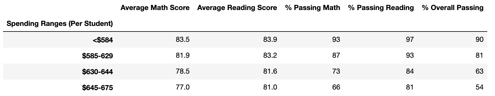
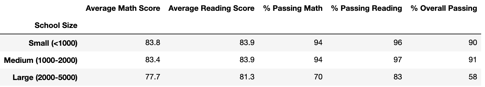
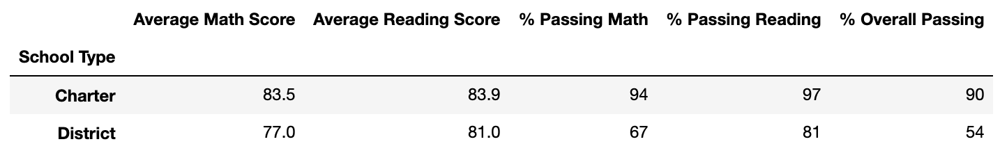

# School District Analysis

## Overview of Project
In this project, Maria, a data scientist, has given me the task of analyzing scores from standardized testing in both math and reading to provide insights on performance trends and patterns. I was asked to create tables displaying the following metrics to complete this analysis.

1. All of the district's key metrics.
2. Key metrics for each school in the district.
3. Top 5 and bottom 5 performing schools, based on the overall passing rate.
4. The average math score received by students in each grade level at each school.
5. The average reading score received by students in each grade level at each school.
6. School performance based on the budget per student.
7. School performance based on the school size.
8. School performance based on the type of school.

## Results
Effects on the district summary:
- The average math score decreased from 79.0 to 78.9
- The average reading score remained unchanged at 81.9
- The percentage of students who passed math decreased from 75% to 74.8%
- The percentage of students who passed reading decreased from 86% to 85.7%
- The overall passing percentage decreased from 65% to 64.9%

Effects on the school summary:
- The change only affected Thomas High Schools' metrics, everything else remained unchanged
  - The average math and reading scores remained unchanged at 83.4 and 83.9, respectively
  - The percentage of students who passed math increased from 66.9% to 93.2%
  - The percentage of students who passed reading increased from 69.7%. to 97.0%
  - The overall passing percentage increased from 65.1% to 90.6%

Effects on Thomas High School's performance:
- Before the grades were changed, Thomas High School was ranked #8 in order of overall passing percentage.
- After the change, Thomas High School moved up in the rankings to #2, with an overall passing percentage of 90.6%.

Effects on specific values:
- Math and reading scores by grade
  - Only the 9th grade scores at Thomas High School were affected by these changes.
  - Before, the average math and reading scores were 83.6 and 83.7, respectively
  - Now, the scores are removed, so there are shown as NaN
- Scores by school spending
  - Because Thomas High School is in the $630-644 range, only that spending bin's metrics were affected
  - Shown below is the updated school spending table:
  - 
- Scores by school size
  - Because Thomas High School is in the Medium school size range, only that size's metrics were affected
  - Shown below is the updated school size table:
  - 
- Scores by school type
  - Because Thomas High School is a Charter School, only charter school metrics were affected
  - Shown below is the updated school type table:
  - 

## Summary
1. major change 1
2. change 2
3. change 3
4. change 4
